# Casa Donizetti

## UX

### Primary Goal

The goal of this project is to provide a modern, easy-to-use platform for customers to discover, book, and enjoy dining experiences at our restaurant.

### Business Needs

* Attract new customers through a modern and informative restaurant website.
* Enable online table reservations to improve convenience and support direct bookings.
* Provide user account features to support repeat visits and reservation management.
 
### User Needs

* A simple and intuitive way to browse the restaurant menu and information.
* A fast and reliable way to make a reservation online.
* Access to personal reservation details through a user profile area

### User Stories

* As a visitor, I want to view the restaurant menu by category so that I can decide what I want before booking or ordering.
* As a visitor, I want to reserve a table for a particular date and time so that I can plan my visit to the restaurant in advance.
* As a returning customer, I want to create an account or sign in so that I can manage my reservations more easily.
* As a signed-in user, I want to view my reservations so that I can check my upcoming bookings.
* As a signed-in user, I want to update or cancel my reservation so that I can manage changes to my booking.
* As an admin, I want to manage menu items, reservations, and restaurant website content so that I can keep the site accurate and up to date.
* As an event planner, I want to submit an enquiry to book the food truck for my event so that I can request catering for a future date
* As a first-time visitor, I want a clear homepage with highlights of the restaurant, featured dishes, easy-to-use navigation, and clear footer 
information so that I can quickly understand what the restaurant offers and easily find the menu, booking, and contact details.

## Design Choices
### Color Scheme
The color palette was chosen to create a warm, elegant, and welcoming Italian restaurant atmosphere:
- **Deep Olive Green (`#2f4a3a`)**: Used for the navigation bar and some highlights.
- **Warm Cream (`#f4ebdd`)**: Main background color
- **Rich Burgundy (`#7a2e35`)**: Used for the footer.
- **Muted Sage Green (`#6b7c5a`)**: Used for highlighted content sections.
- **Light Cream (`#f4ebdd`)**: Used for navigation links and text on darker backgrounds.
- **Antique Gold (`#b08d57`)**: Primary call-to-action color.
- **Dark Antique Gold (`#9a7846`)**: Hover state for call-to-action elements.
- **Dark Espresso Brown (`#241a17`)**: Primary heading color.
- **Charcoal Brown (`#2b2621`)**: Main body text color.
- **Soft Ivory (`#fff4e8`)**: Footer link color.

### Typography

- **Playfair Display (Serif)**: Used for headings, navigation links, buttons, and key titles.
- **Lato (Sans-Serif)**: Used for body text, footer content, and general readable content.

### Layout & Navigation

**Fixed Navigation Bar**: Responsive fixed-top navbar providing access to:
- Brand logo linking to the homepage
- Home and Menu pages
- Register and Login links for logged-out users
- Profile and Logout links for authenticated users
- Admin link for superusers
- Desktop “Reserve a Table” call-to-action button
- Hamburger/offcanvas navigation on smaller screens

**Homepage Layout**:
- Dynamic welcome section displaying restaurant information from the database
- Feature section promoting the menu with a “View Menu” button
- Feature section promoting private dining with a “Contact Us” button
- Two-column image/text layouts on medium and larger screens
- Single-column stacked layout on mobile

**Sticky Mobile CTA**:
- Mobile-only fixed call-to-action banner appears near the bottom centre of the screen.
- Intended to provide quick access to table reservations on smaller devices.

**User Feedback**:
- Logged-in/logged-out status badge displayed below the navbar
- Dismissible alert messages used for reservation, account, and form feedback

### Component Selection

**Homepage Feature Blocks**:
- Large responsive sections combining image, heading, text, and CTA button
- Used to guide users toward the menu and private dining information

**Dynamic Menu Page**:
- Menu sections generated from database content
- Section anchor navigation for quick browsing
- Menu items grouped by category
- Each menu item displays name, description, and price

**Featured Menu Cards**:
- Responsive Bootstrap card grid for featured menu items
- Cards display menu item image and name
- Featured items are controlled from the database

**Reservation Form**:
- Authenticated users can reserve a table online
- Collects party size, reservation date, and reservation time
- Uses crispy forms and CSRF protection
- Reservation availability is checked before saving

**Profile Reservation Table**:
- Authenticated users can view their reservations
- Displays date, time, party size, and assigned table
- Includes actions for editing and cancelling reservations
- Empty-state message appears when no reservations exist

**Edit Reservation Modal**:
- Bootstrap modal allows users to update an existing reservation
- JavaScript pre-fills the form with current reservation details
- Submits updated date, time, and party size for availability checking

**Cancel Reservation Modal**:
- Bootstrap confirmation modal prevents accidental cancellations
- Displays selected reservation date/time
- Submits cancellation through as a POST form

**Authentication Forms**:
- Custom login, registration, and logout pages
- Login page includes a password reset link
- Navigation updates based on authentication state

**Footer**:
- Quick links to main pages
- Restaurant address, phone, email, and opening hours
- Dynamic social media links with icons

### Responsive Design

Mobile-first Bootstrap layouts ensure the site adapts across screen sizes.

**Breakpoints:**
- **< 576px**: Single-column content, simplified footer, mobile CTA visible
- **576px - 768px**: Improved spacing with mostly stacked layouts
- **768px - 992px**: Two-column homepage sections, desktop footer columns, desktop reserve CTA
- **992px - 1200px**: Wider content areas and improved table/menu readability
- **> 1200px**: Expanded layouts with comfortable spacing

**Key Responsive Behaviors:**
- Navbar changes from desktop links to hamburger/offcanvas navigation on smaller screens
- Homepage image/text sections stack on mobile and become two columns from medium screens upward
- Featured menu cards display one column on mobile and three columns from medium screens upward
- Menu items display one column on mobile and two columns from medium screens upward
- Profile reservation table is wrapped in a responsive container
- Edit and cancel reservation buttons stack on mobile screens and become inline on larger screens.
- Footer quick links and contact columns are hidden on small screens
- Social links remain accessible in the footer across screen sizes
- Mobile reservation CTA is fixed near the bottom of the viewport

# Features

This website is built as a responsive Django web application for Casa Donizetti, designed to provide an intuitive experience for customers browsing the restaurant’s menu, creating accounts, and reserving tables online. Features are powered by Django templates, Bootstrap 5.3.8, JavaScript, and supporting packages such as Django Allauth, Cloudinary, Crispy Forms, and Summernote. Key features include:

## 1. Responsive Navigation Bar
**Description:** Fixed-top responsive navigation bar with user-aware links and a clear reservation call-to-action.

**Details:**
- Mobile-friendly navigation using Bootstrap offcanvas components
- Navigation updates depending on authentication status
- Logged-out users see Register and Login links
- Logged-in users see Profile and Logout links
- Superusers have direct access to the Django admin panel
- Includes a prominent "Reserve a Table" call-to-action

**Technical Details:**
- Built with Bootstrap navbar and offcanvas components
- Uses Django template logic to conditionally display navigation items
- Styled with custom CSS for a consistent restaurant-themed design

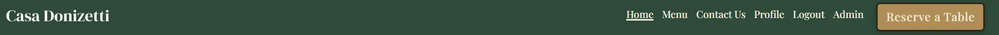

## 2. Dynamic Homepage and Restaurant Content
**Description:** Public-facing homepage that dynamically displays restaurant information and promotional content.

**Details:**
- Displays restaurant name and editable content from the database
- Includes sections promoting the menu and private dining
- Uses responsive layouts and branded imagery
- Provides a direct call-to-action linking visitors to the menu page

**Technical Details:**
- Powered by the Restaurant model
- Content is rendered dynamically through Django templates
- Admin-managed rich text is supported through Summernote

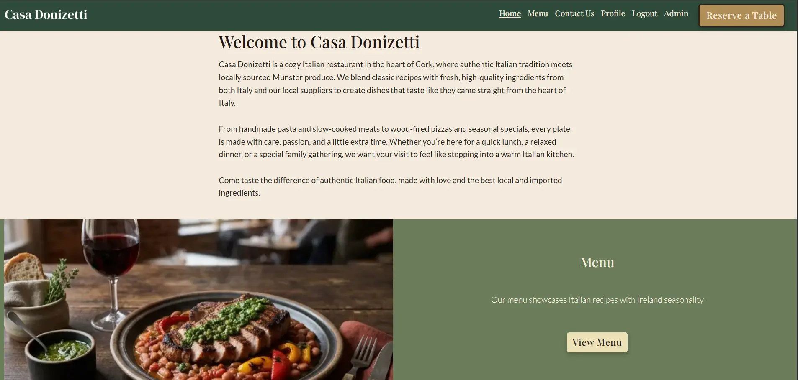

## 3. Dynamic Menu System
**Description:** Database-driven menu page that allows customers to browse menu sections and featured dishes.

**Details:**
- Displays the active restaurant menu
- Organises dishes into menu sections such as starters, mains, and desserts
- Shows item names, descriptions, and prices
- Highlights featured menu items using image cards
- Supports section-based navigation for easier browsing

**Technical Details:**
- Uses Django models including Menu, MenuSection, and MenuItem
- Menu sections and items support ordering with sort order fields
- Featured images are supported through Cloudinary
- Menu item descriptions can be managed with Summernote in the admin panel
- Bootstrap navbar for section navigation

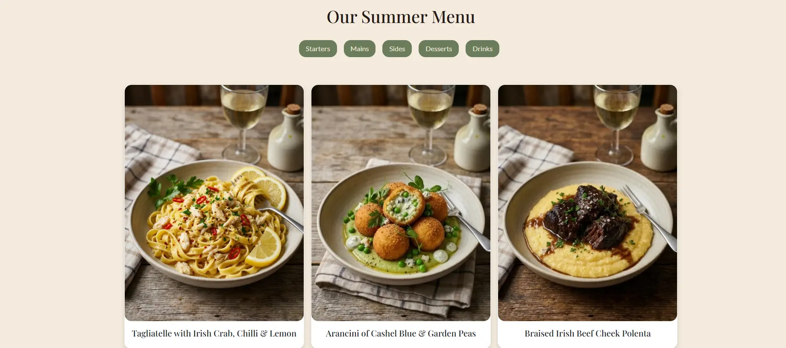
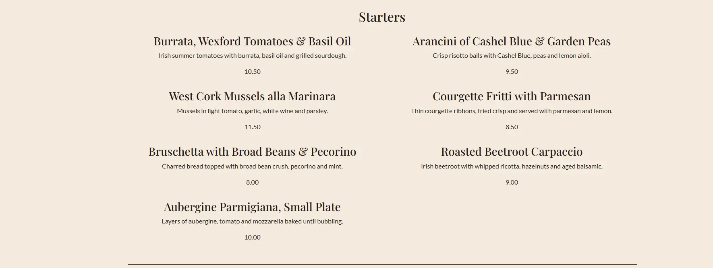

## 4. User Authentication and Profile Management
**Description:** Account system that allows users to register, log in, and manage their profile information.

**Details:**
- Supports user signup, login, logout, and password reset
- Displays different navigation states depending on whether the user is authenticated
- Provides users with a profile page showing account details
- Displays reservation history in the user profile area
- Supports email confirmation during signup to verify new user accounts.

**Technical Details:**
- Powered by Django Allauth for authentication flows
- Uses custom authentication templates
- Profile data is stored through a linked Profile model
- Protected views use Django authentication controls
- Django Allauth Email confirmation, Current settings: ACCOUNT_EMAIL_VERIFICATION = "optional" and uses console as email backend.

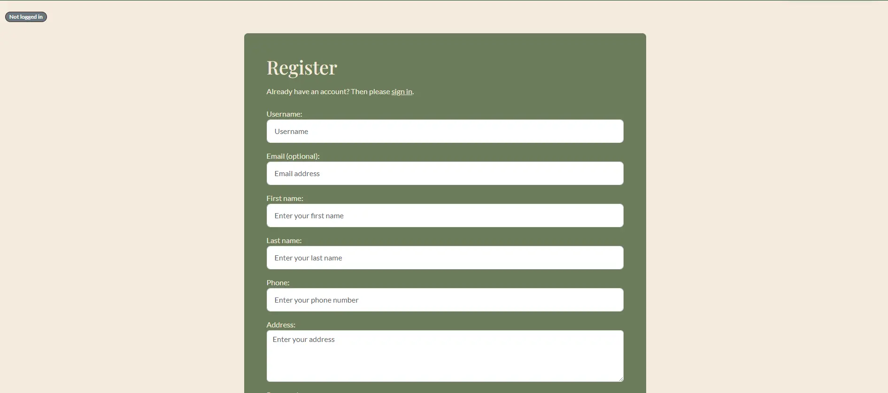
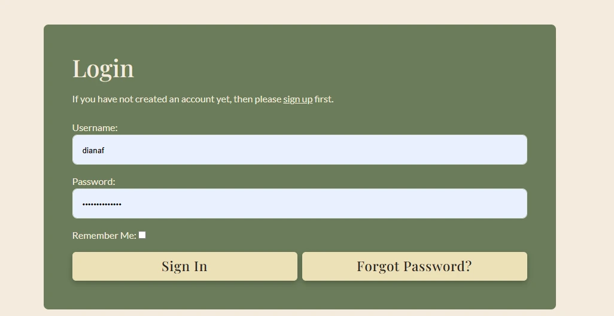
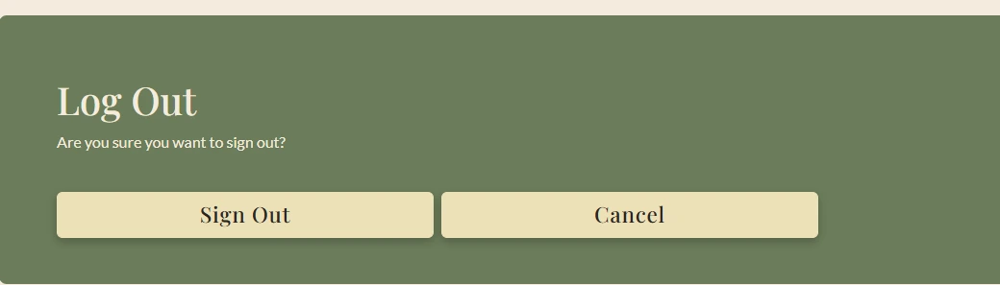
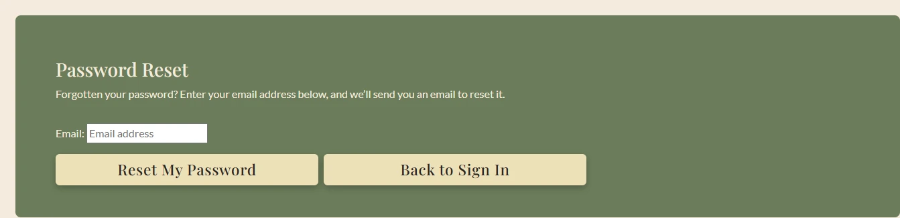
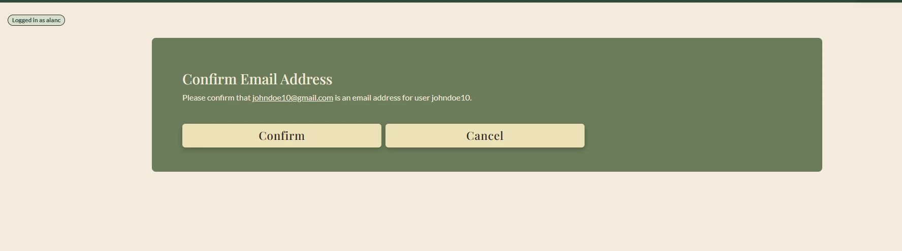
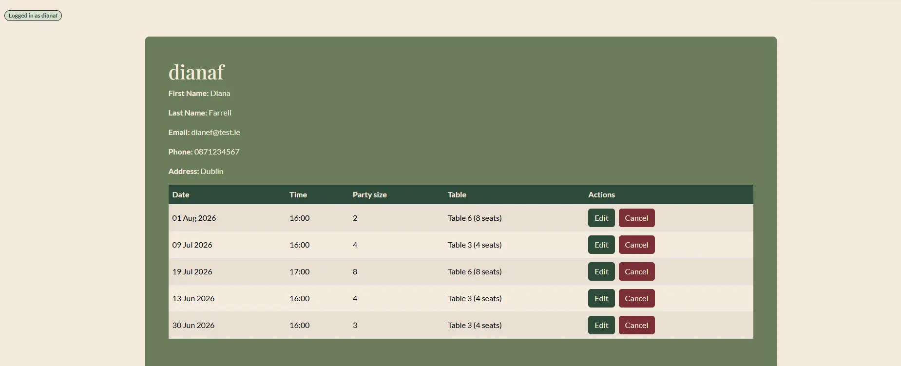

## 5. Online Table Reservation System
**Description:** Reservation feature that allows logged-in users to book tables online based on party size, date, and time.

**Details:**
- Users can choose party size, reservation date, and reservation time
- Reservation times are available in 15-minute intervals
- The system automatically assigns a suitable table
- Users receive feedback when a booking is successful or when no table is available
- Reservation access is limited to authenticated users

**Technical Details:**
- Built with Django forms and server-side validation
- Reservation logic checks table capacity and existing bookings
- Uses Django messages to display success and error alerts
- Form rendering is enhanced with Crispy Forms

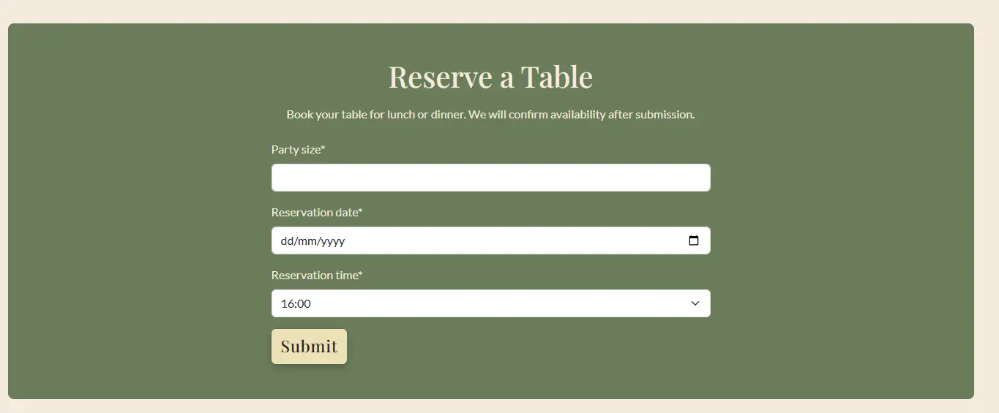

## 6. Reservation Editing and Cancellation
**Description:** Logged-in users can manage their bookings directly from their profile page.

**Details:**
- Users can view their current reservations in a structured table
- Reservations can be edited using a modal form
- Reservations can be cancelled through a confirmation modal
- Booking updates are limited to the reservation owner
- Updated reservations are rechecked for availability before saving

**Technical Details:**
- Uses Bootstrap modals for edit and cancel actions
- JavaScript dynamically inserts reservation data into modal forms
- Django views enforce ownership and availability checks
- Reservation actions provide feedback through Django messages
- 
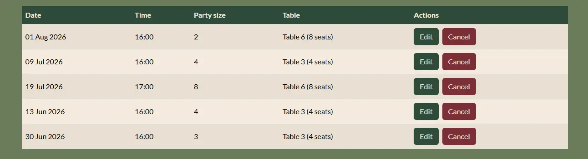
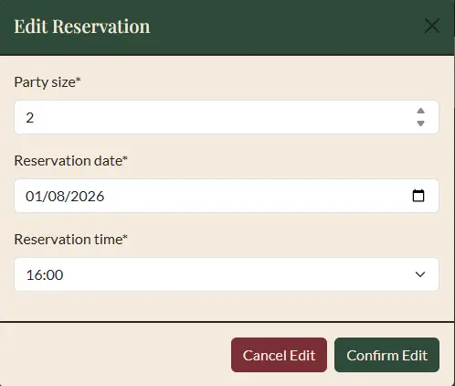
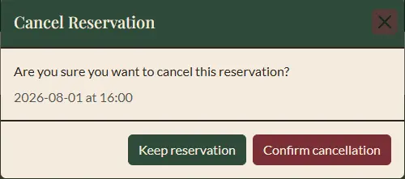

## 7. Admin Content and Reservation Management
**Description:** Django admin tools allow staff and administrators to manage restaurant content, menu data, tables, reservations, and supporting site information.

**Details:**
- Admin users can manage restaurant content, contact details, and opening hours
- Menu items, menu sections, and active menus can be updated from the admin panel
- Tables and reservations can be viewed, filtered, and managed
- Social media links displayed in the footer can be maintained by admin users
- Customer profile records can also be managed by staff

**Technical Details:**
- Uses Django admin model registration and configuration
- Includes list views, filters, search, and slug prepopulation
- Summernote is used for rich-text editing in selected fields
- Reservation and menu management are fully database-driven

!(admin panel)[documentation/screenshots/admin-panel.webp]

## 8. Responsive Layout, Footer, and UI Components
**Description:** Responsive frontend design that supports a polished user experience across desktop and mobile devices.

**Details:**
- Fixed-top navbar and responsive page sections
- Menu cards and content grids adapt across screen sizes
- Footer displays restaurant contact details, opening hours, and social links
- Includes a custom 404 page for invalid routes

**Technical Details:**
- Built with Bootstrap 5.3.8 components and utility classes
- Uses custom CSS variables, Google Fonts, and themed styling
- Social links are rendered dynamically from the database
- JavaScript enhances interactive UI elements such as reservation modals

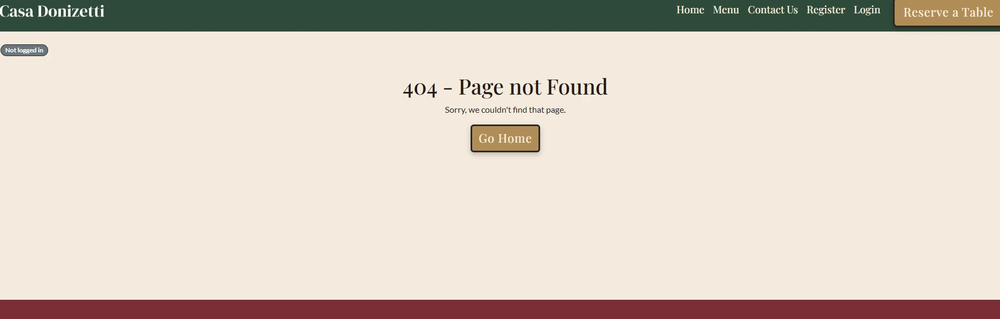
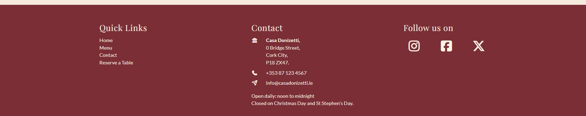
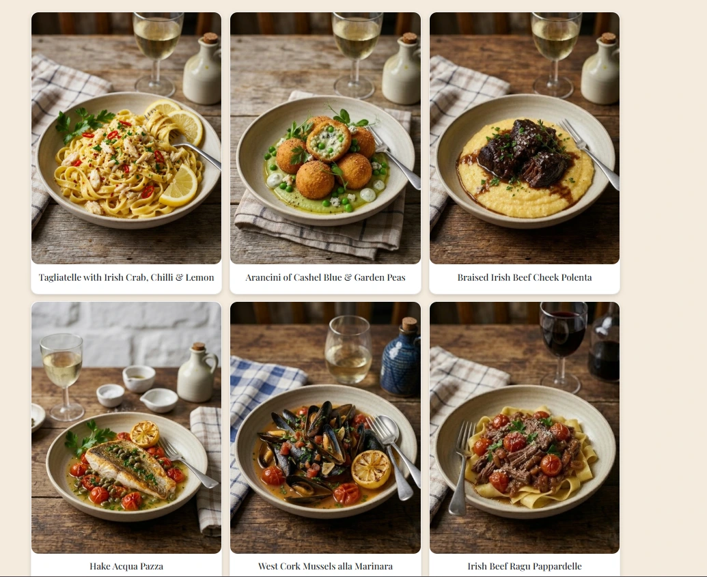
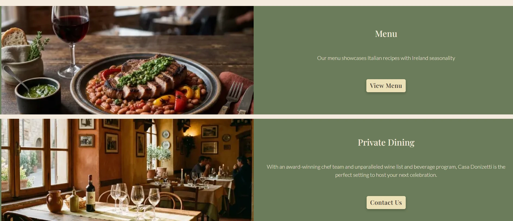

# Code
### Code Sources and Credit
- Custom Context Processors: used to create a global footer using model object data. 
  Reference: https://labofcoding.com/posts/how-to-write-custom-context-processors-in-django/
- modelForms widgets: used to customize the form fields and validation. Reference: https://docs.djangoproject.com/en/4.2/topics/forms/widgets/ 
 and https://docs.djangoproject.com/en/6.0/topics/forms/modelforms/, and https://www.youtube.com/watch?v=-oWIyFYyNQw&t
- cleaned_data:
-  Datetime conversion using Python datetime module: reference: https://docs.python.org/3/library/datetime.html and https://www.geeksforgeeks.org/python-datetime-strptime/
- filter and exclude: https://www.w3schools.com/django/django_queryset_filter.php, https://stackoverflow.com/questions/50904405/django-filter-exclude-against-list-of-objects
- create_user
- Conditional Django forms: adjust reservation form based on logged in status. Inspiration from https://docs.djangoproject.com/en/6.0/ref/forms/fields/ and https://stackoverflow.com/questions/1466512/remove-fields-from-modelform
- add_error
- AllAuth Customisation:  https://docs.allauth.org/en/dev/index.html and tutorial series by BugBytes - Django AllAuth Deep Dive: https://www.youtube.com/playlist?list=PL-2EBeDYMIbQqZZoo5Dj8YAkPnZeJfcZS
- In edit reservation test, used to obj.refresh_from_db() to refresh reservation model values from database. Source: https://docs.djangoproject.com/en/6.0/ref/models/instances/ 
- Editing default allauth forms: https://stackoverflow.com/questions/29716023/add-class-to-form-field-django-modelform and https://gist.github.com/ronaldgreeff/3b2da951245860f262408496c6ef36a3

## Bugs and Issues
- Had issues deploying to Heroku with Cloudinary. Fixed by adding cloudinary:// before apikey in config var setting.
- TypeError: "combine() argument 2 must be datetime.time, not str." Fixed by converting time to datetime.time. before using combine().
- When testing email confirmation using terminal email backed, link used to confirm was malformed in terminal email. insert '=' in confirm-email. Remove to fix.
- Had difficulties displaying date in the edit reservation form. Need to use YYYY-MM-DD format to populate even though it is displayed in DD/MM/YYYY format.
- Had issues writing test for reservation_view due to login_required decorator. Need to add self.client.login(...) to test.
- When writing test for reservation_view form submission: initially tried to test for 200 status code, but it was returning 302. Changed assert to 302 to test for redirect.
- When trying to override allauth forms, encountered error: circular import. Solution was to move allauth forms to a separate file. One for signup, and one for login. Source for fix: https://stackoverflow.com/questions/72717979/python-importerror-cannot-import-name-from-partially-initialized-module
    Error message: "django.core.exceptions.ImproperlyConfigured: Error importing form class restaurant.forms: "cannot import name 'SignupForm' from partially initialized module 'allauth.account.forms' (most likely due to a circular import) (C:\Users\alanc\Documents\VS Code Projects\casadonizetti\.venv\Lib\site-packages\allauth\account\forms.py)"
- When adding form-control to the login form input fields, initial version broke remember me checkbox. Fixed by excluding form-control from checkbox.
- In profile, in the reservation table when reservations were empty the no reservation message was only displaying one cell. Fix add col-span= [table-length] to td so empty cells are displayed. 
# Tools and Resources

**Development Environment:**
- PyCharm for code editing and debugging
- GitHub for version control
- Heroku for deployment

**Languages & Frameworks:**
- HTML5, CSS, JavaScript ES8 for frontend development
- Bootstrap 5.3 for responsive design and components

**Libraries & UI Components:**
- Font Awesome for icons
- Google Maps API for interactive maps and location visualization

**Validation & Testing Tools:**
- W3C Markup Validation Service and djlint Python package for HTML validation
- W3C CSS Validation Service for CSS validation
- JSHint for JavaScript linting and error checking
- Lighthouse for performance and accessibility testing

**Content & Design Tools:**
- Perplexity for discovery, text content generation, and drafting documentation. 
- Canva for wireframing and image editing
- Artlist.io for generative image creation
- TinyPNG for image compression
- Draw.io for entity relationship model
