# Casa Donizetti

## UX

### Primary Goal

The goal of this project is to provide a modern, easy-to-use platform for customers to discover, book, and enjoy dining experiences at our restaurant.

### Business Needs

* Attract new customers through a modern and informative restaurant website.
* Enable online table reservations to improve convenience and support direct bookings.
* Provide user account features to support repeat visits and reservation management.
 
### User Needs

* A simple and intuitive way to browse the restaurant menu and information.
* A fast and reliable way to make a reservation online.
* Access to personal reservation details through a user profile area.

### Agile Planning

User stories were used to guide the development process and testing. Core features were prioritised around the main customer journey: viewing the menu, creating an account, making a reservation, and managing bookings.

* As a visitor, I want to view the restaurant menu by category so that I can decide what I want before booking or ordering.
* As a visitor, I want to reserve a table for a particular date and time so that I can plan my visit to the restaurant in advance.
* As a visitor, I want to create an account or sign in so that I can manage my reservations more easily.
* As a signed-in user, I want to view my reservations so that I can check my upcoming bookings.
* As a signed-in user, I want to update or cancel my reservation so that I can manage changes to my booking.
* As an admin, I want to manage menu items, reservations, and restaurant website content so that I can keep the site accurate and up to date.
* As an event planner, I want to submit an enquiry or book the restaurant for a private dining event.
* As a first-time visitor, I want a clear homepage with highlights of the restaurant, featured dishes, easy-to-use navigation, and clear footer 
information so that I can quickly understand what the restaurant offers and easily find the menu, booking, and contact details.
* As a visitor, I want the website to adapt across all my devices so that I can browse restaurant information, menu content, and reservation features comfortably on any screen size.

## Design Choices
### Color Scheme
The color palette was chosen to create a warm, elegant, and welcoming Italian restaurant atmosphere:
- **Deep Olive Green (`#2f4a3a`)**: Used for the navigation bar and some highlights.
- **Warm Cream (`#f4ebdd`)**: Main background color.
- **Rich Burgundy (`#7a2e35`)**: Used for the footer.
- **Muted Sage Green (`#6b7c5a`)**: Used for highlighted content sections.
- **Sand (`#ece0b8`)**: Used for section-level buttons or accent areas.
- **Light Cream (`#f4ebdd`)**: Used for navigation links and text on darker backgrounds.
- **Antique Gold (`#b08d57`)**: Primary call-to-action color.
- **Dark Antique Gold (`#9a7846`)**: Hover state for call-to-action elements.
- **Dark Espresso Brown (`#241a17`)**: Used for headings.
- **Charcoal Brown (`#2b2621`)**: Main body text color.
- **Soft Ivory (`#fff4e8`)**: Footer link color.


### Typography

- **Playfair Display (Serif)**: Used for headings, navigation links, buttons, and key titles.
- **Lato (Sans-Serif)**: Used for body text, footer content, and general readable content.

### Layout & Navigation

**Fixed Navigation Bar**: Responsive fixed-top navbar providing access to:
- Brand logo linking to the homepage
- Home and Menu pages
- Link to Contact Us page
- Register and Login links for logged-out users
- Profile and Logout links for authenticated users
- Admin link for superusers
- Desktop “Reserve a Table” call-to-action button
- Hamburger/offcanvas navigation on smaller screens

**Homepage Layout**:
- Dynamic welcome section displaying restaurant information from the database
- Feature section promoting the menu with a “View Menu” button
- Feature section promoting private dining with a “Contact Us” button
- Two-column image/text layouts on medium and larger screens
- Single-column stacked layout on mobile

**Sticky Mobile CTA**:
- Mobile-only fixed call-to-action banner appears near the bottom centre of the screen.
- Intended to provide quick access to table reservations on smaller devices.

**User Feedback**:
- Logged-in/logged-out status badge displayed below the navbar
- Dismissible alert messages used for reservation, account, and form feedback

### Component Selection

**Homepage Feature Blocks**:
- Large responsive sections combining image, heading, text, and CTA button
- Used to guide users toward the menu and private dining information

**Dynamic Menu Page**:
- Menu sections generated from database content
- Section anchor navigation for quick browsing
- Menu items grouped by category
- Each menu item displays name, description, and price

**Featured Menu Cards**:
- Responsive Bootstrap card grid for featured menu items
- Cards display menu item image and name
- Featured items are controlled from the database

**Contact Us Form**:
- Visitors can contact the restaurant through this form
- Collects name, email, phone, and message for a general enquiry
- Can also submit request for private dining reservation, additionally requesting party size and date.
- Uses crispy forms and CSRF protection.

**Reservation Form**:
- Authenticated users can reserve a table online
- Collects party size, reservation date, and reservation time
- Uses crispy forms and CSRF protection
- Reservation availability is checked before saving

**Profile Reservation Table**:
- Authenticated users can view their reservations
- Displays date, time, party size, and assigned table
- Includes actions for editing and cancelling reservations
- Empty-state message appears when no reservations exist

**Edit Reservation Modal**:
- Bootstrap modal allows users to update an existing reservation
- JavaScript pre-fills the form with current reservation details
- Submits updated date, time, and party size for availability checking

**Cancel Reservation Modal**:
- Bootstrap confirmation modal prevents accidental cancellations
- Displays selected reservation date/time
- Submits cancellation through as a POST form

**Authentication Forms**:
- Custom login, registration, and logout pages
- Login page includes a password reset link
- Navigation updates based on authentication state

**Footer**:
- Quick links to main pages
- Restaurant address, phone, email, and opening hours
- Dynamic social media links with icons

### Responsive Design

Mobile-first Bootstrap layouts ensure the site adapts across screen sizes.

**Breakpoints:**
- **< 576px**: Single-column content, simplified footer, mobile CTA visible
- **576px - 768px**: Improved spacing with mostly stacked layouts
- **768px - 992px**: Two-column homepage sections, desktop footer columns, desktop reserve CTA
- **992px - 1200px**: Wider content areas and improved table/menu readability
- **> 1200px**: Expanded layouts with comfortable spacing

**Key Responsive Behaviors:**
- Navbar changes from desktop links to hamburger/offcanvas navigation on smaller screens
- Homepage image/text sections stack on mobile and become two columns from medium screens upward
- Featured menu cards display one column on mobile and three columns from medium screens upward
- Menu items display one column on mobile and two columns from medium screens upward
- Profile reservation table is wrapped in a responsive container
- Edit and cancel reservation buttons stack on mobile screens and become inline on larger screens.
- Footer quick links and contact columns are hidden on small screens
- Social links remain accessible in the footer across screen sizes
- Mobile reservation CTA is fixed near the bottom of the viewport

### Wireframes
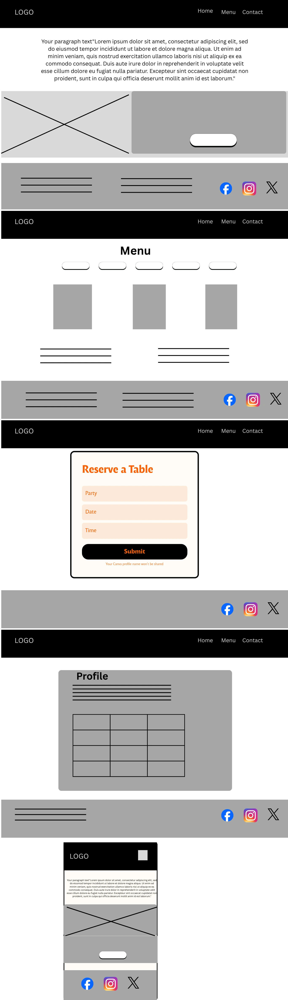


## Database Model Overview

The project uses several Django models to manage restaurant content, menus, user profiles, and reservations.

| Model            | Purpose                                                                                                              |
|------------------|----------------------------------------------------------------------------------------------------------------------|
| `Restaurant`     | Stores core restaurant details such as name, contact information, address, opening time, and closing time            |
| `SocialLink`     | Stores social media links displayed in the footer                                                                    |
| `Profile`        | Stores additional user contact details linked to a Django user account                                               |
| `Menu`           | Represents a restaurant menu and controls which menu is active                                                       |
| `MenuSection`    | Groups menu items into sections such as starters, mains, desserts, and drinks                                        |
| `MenuItem`       | Stores individual dishes, descriptions, prices, featured status, and images                                          |
| `Table`          | Represents reservable restaurant tables and their capacities                                                         |
| `Reservation`    | Stores booking details including customer contact information, party size, assigned table, and reservation date/time |
| `ContactRequest` | Stores Contact Form submissions, including general enquiry and private dining requests                               |

### Entity Relationship Model:
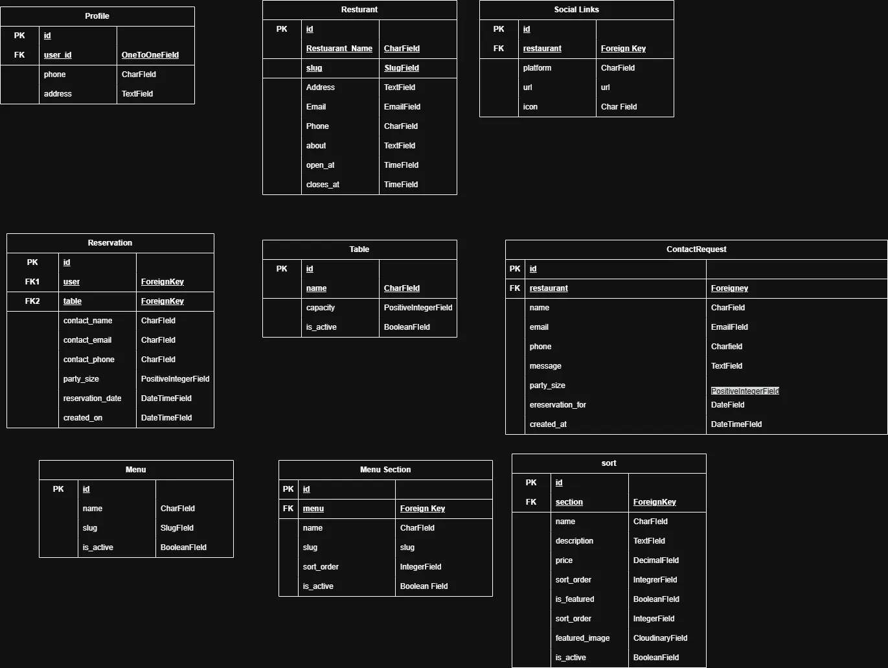

---

# Features

This website is built as a responsive Django web application for Casa Donizetti, designed to provide an intuitive experience for customers browsing the restaurant’s menu, creating accounts, and reserving tables online. Features are powered by Django templates, Bootstrap 5.3.8, JavaScript, and supporting packages such as Django Allauth, Cloudinary, Crispy Forms, and Summernote. Key features include:

## 1. Responsive Navigation Bar
**Description:** Fixed-top responsive navigation bar with user-aware links and a clear reservation call-to-action.

**Details:**
- Mobile-friendly navigation using Bootstrap offcanvas components
- Navigation updates depending on authentication status
- Logged-out users see Register and Login links
- Logged-in users see Profile and Logout links
- Superusers have direct access to the Django admin panel
- Includes a prominent "Reserve a Table" call-to-action

**Technical Details:**
- Built with Bootstrap navbar and offcanvas components
- Uses Django template logic to conditionally display navigation items
- Styled with custom CSS for a consistent restaurant-themed design


## 2. Dynamic Homepage and Restaurant Content
**Description:** Public-facing homepage that dynamically displays restaurant information and promotional content.

**Details:**
- Displays restaurant name and editable content from the database
- Includes sections promoting the menu and private dining
- Uses responsive layouts and branded imagery
- Provides a direct call-to-action linking visitors to the menu page

**Technical Details:**
- Powered by the Restaurant model
- Content is rendered dynamically through Django templates
- Admin-managed rich text is supported through Summernote


## 3. Dynamic Menu System
**Description:** Database-driven menu page that allows customers to browse menu sections and featured dishes.

**Details:**
- Displays the active restaurant menu
- Organises dishes into menu sections such as starters, mains, and desserts
- Shows item names, descriptions, and prices
- Highlights featured menu items using image cards
- Supports section-based navigation for easier browsing

**Technical Details:**
- Uses Django models including Menu, MenuSection, and MenuItem
- Menu sections and items support ordering with sort order fields
- Featured images are supported through Cloudinary
- Menu item descriptions can be managed with Summernote in the admin panel
- Bootstrap navbar for section navigation


## 4. User Authentication and Profile Management
**Description:** Account system that allows users to register, log in, and manage their profile information.

**Details:**
- Supports user signup, login, logout, and password reset
- Displays different navigation states depending on whether the user is authenticated
- Provides users with a profile page showing account details
- Displays reservation history in the user profile area
- Supports email confirmation during signup to verify new user accounts.

**Technical Details:**
- Powered by Django Allauth for authentication flows
- Uses custom authentication templates
- Profile data is stored through a linked Profile model
- Protected views use Django authentication controls
- Django Allauth Email confirmation, Current settings: ACCOUNT_EMAIL_VERIFICATION = "optional" and uses console as email backend.


## 5. Online Table Reservation System
**Description:** Reservation feature that allows logged-in users to book tables online based on party size, date, and time.

**Details:**
- Users can choose party size, reservation date, and reservation time
- Reservation times are available in 15-minute intervals
- The system automatically assigns a suitable table
- Users receive feedback when a booking is successful or when no table is available
- Reservation access is limited to authenticated users

**Technical Details:**
- Built with Django forms and server-side validation
- Reservation logic checks table capacity and existing bookings
- Uses Django messages to display success and error alerts
- Form rendering is enhanced with Crispy Forms
- Validators for party size ensure only valid party sizes are accepted.


## 6. Reservation Editing and Cancellation
**Description:** Logged-in users can manage their bookings directly from their profile page.

**Details:**
- Users can view their current reservations in a structured table
- Reservations can be edited using a modal form
- Reservations can be cancelled through a confirmation modal
- Booking updates are limited to the reservation owner
- Updated reservations are rechecked for availability before saving

**Technical Details:**
- Uses Bootstrap modals for edit and cancel actions
- JavaScript dynamically inserts reservation data into modal forms
- Django views enforce ownership and availability checks
- Reservation actions provide feedback through Django messages


## 7. Admin Content and Reservation Management
**Description:** Django admin tools allow staff and administrators to manage restaurant content, menu data, tables, reservations, and supporting site information.

**Details:**
- Admin users can manage restaurant content, contact details, and opening hours
- Menu items, menu sections, and active menus can be updated from the admin panel
- Tables and reservations can be viewed, filtered, and managed
- Social media links displayed in the footer can be maintained by admin users
- Customer profile records can also be managed by staff
- Contact requests and private dining enquiries can be reviewed by admin users.

**Technical Details:**
- Uses Django admin model registration and configuration
- Includes list views, filters, search, and slug prepopulation
- Summernote is used for rich-text editing in selected fields
- Reservation and menu management are fully database-driven

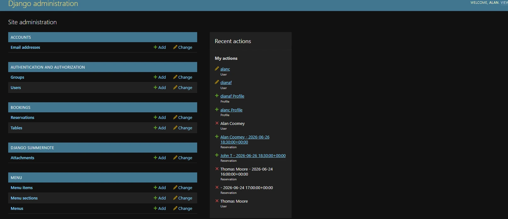

## 8. Responsive Layout, Footer, and UI Components
**Description:** Responsive frontend design that supports a polished user experience across desktop and mobile devices.

**Details:**
- Fixed-top navbar and responsive page sections
- Menu cards and content grids adapt across screen sizes
- Footer displays restaurant contact details, opening hours, and social links
- Includes a custom 404 page for invalid routes

**Technical Details:**
- Built with Bootstrap 5.3.8 components and utility classes
- Uses custom CSS variables, Google Fonts, and themed styling
- Social links are rendered dynamically from the database
- JavaScript enhances interactive UI elements such as reservation modals


## 9. Contact and Private Dining Enquiry System

**Description:** Visitors can contact the restaurant or submit a private dining enquiry through a dedicated contact form.

**Details:**
- Contact page is available to all visitors through the main navigation.
- Visitors can submit a general enquiry with their name, email, phone number, and message.
- Visitors can choose a private dining request type.
- When private dining is selected, additional fields are displayed for party size and preferred date.
- Successful submissions are saved and can be reviewed by admins.

**Technical Details:**
- Built using a Django ModelForm connected to the ContactRequest model.
- Uses Django server-side validation.
- Uses JavaScript to show or hide private dining fields based on request type.
- Uses Crispy Forms and CSRF protection.
- Admin users can review submitted contact requests in the Django admin panel.

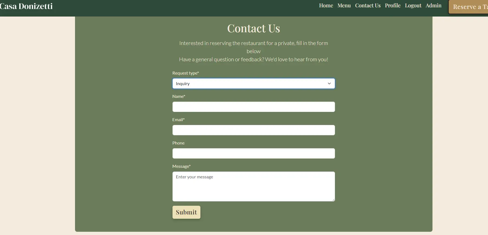
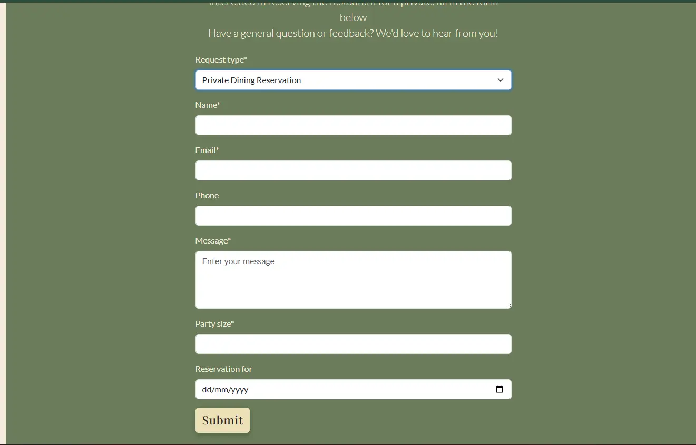

---
# Future Features
- Visitor can reserve a table as a guest without creating an account.
- Add orders application to facilitate online ordering and takeaway services.
- Add catering services for business customers.
- User ability to update profile details.
- Dietary filter options for menu items.
- Dashboard for restaurant staff to manage reservations.
---

# Testing
Website was thoroughly tested using user personas and stories as a guide.

**User Story 1 – Menu Page:** As a visitor, I want to view the restaurant menu by category so that I can decide what I want before booking or ordering.

**Pathways Tested (all passed):**
- A public menu page is available through the main navigation.
- Category tabs switch correctly between menu views.
- Only the selected menu category content is shown at one time.
- Menu items are organised into clear sections such as Starters, Mains, Sides, Desserts, Drinks.
- Every listed item includes a title, short description, and visible price.
- Featured dishes or menu highlights are displayed on the homepage.

**User Story 2 – Reservation Form:** As a visitor, I want to reserve a table for a particular date and time so that I can plan my visit to the restaurant in advance.

**Pathways Tested (all passed):**
- Reservation booking page is accessible from the main website navigation.
- The booking page displays a Django-rendered reservation form.
- The form includes fields for date, time, and party size.
- Users must be registered and logged in before making a reservation.
- Form validation is handled correctly by Django.
- Availability and booking rules are checked in Django before the reservation is saved.
- If submission fails, the same page is re-rendered with validation errors and previously entered values are preserved where appropriate.
- If submission succeeds, the reservation is saved and a Bootstrap success alert is displayed to confirm the booking.


**User Story 3 – User account registration and sign in:** As a returning customer, I want to create an account or sign in so that I can manage my reservations more easily.

**Pathways Tested (all passed):**
- Sign up and sign in pages are accessible from the website navigation.
- The sign up form collects the required account details and validates them in Django before creating the account.
- If the sign up form is submitted with invalid data, the page is re-rendered with validation errors displayed.
- A registered user can sign in successfully using Django authentication.
- After successful sign in, the user is redirected to the homepage.
- If sign in fails, a clear error message is displayed to the user.

**User Story 4 - View reservations:** As a signed-in user, I want to view my reservations so that I can check my upcoming bookings.

**Pathways Tested (all passed):**
- Profile or My Reservations page is accessible to authenticated users.
- Upcoming reservations associated with the signed-in user account are displayed correctly.
- Each reservation entry includes date, time, party size.
- When no reservations exist for the user, a clear empty state message is shown.

**User Story 5 - Manage Reservations:** As a signed-in user, I want to update or cancel my reservation so that I can manage changes to my booking.

**Pathways Tested (all passed):**
- Users can edit their own future reservation details, including date, time, party size, and comments, in line with booking rules.
- Users can cancel their own future reservations.
- Invalid or unavailable reservation updates are rejected, with the form re-rendered and validation errors shown.
- Successful updates trigger a Bootstrap success alert.
- Successful cancellations trigger a Bootstrap success alert.

**User Story 6 - Admin Panel Management:** As an admin, I want to manage menu items, reservations, and restaurant website content so that I can keep the site accurate and up to date.

**Pathways Tested (all passed):**
- Admin users can access the Django admin panel.
- Admin users can create, edit, and delete menu categories and menu items.
- Admin users can view, update, and cancel reservations.
- Reservation records in the admin panel display key details, including customer information, date, time, party size
- Admin users can manage editable restaurant content such as the restaurant section, opening hours, and contact details.
- Changes made in the admin panel are reflected correctly on the public website.

**User Story 7 - Homepage, navigation and footer:** As a first-time visitor, I want a clear homepage with highlights of the restaurant, featured dishes, easy-to-use navigation, and clear footer information so that I can quickly understand what the restaurant offers and easily find the menu, booking, and contact details.

**Pathways Tested (all passed):**
- Homepage loads with the restaurant name and introductory text clearly visible.
- Book a Table call to action is present and clearly identifiable.
- Main navigation includes links to Home, Menu, Contact, and Book a Table.
- Footer displays opening hours, contact details, and location information.
- Footer is shown consistently across all main site pages.

**User Story 8 – Event Planning Enquiry:** As an event planner, I want to submit an enquiry or book the restaurant for a private dining event so that I can plan and confirm a group reservation.

**Pathways Tested (all passed):**
- Contact Request page is available from the website navigation, for all users.
- The booking page displays a Django-rendered Contact form.
- The form includes fields for request type, contact name, email, phone number, event date, estimated party size, and additional event details.
- The form adapts based on request type, displaying additional fields when type is private dining.
- Form validation is handled correctly by Django.
- When the form is invalid, the page is re-rendered with validation errors.
- When the form is submitted successfully, the enquiry is saved and the user sees a confirmation message.
- If submission fails, the same page is re-rendered with validation errors and previously entered values are preserved where appropriate.
- Submitted contact requests are available to admins for review.

**User Story 9 – Responsive design:** As a visitor, I want the website to adapt across all my devices so that I can browse restaurant information, menu content, and reservation features comfortably on any screen size.
**Pathways Tested (all passed):**

**Mobile (< 576px):**
- Navbar collapses into a hamburger/offcanvas menu and all navigation links remain accessible.
- Homepage content sections stack into a single-column layout without overlapping text or images.
- Featured menu cards display in a single-column layout.
- Menu item sections display clearly in a single-column layout with readable text and visible prices.
- Profile reservation table remains usable inside its responsive container without breaking the page layout.
- Edit and cancel reservation buttons stack cleanly on smaller screens.
- Footer quick links and contact columns are hidden as intended on small screens, while social links remain visible and accessible.
- Mobile reservation call-to-action remains visible near the bottom of the viewport without obscuring key content.

**Tablet (576px – 992px):**
- Navigation remains clear and accessible as screen width increases.
- Content remains readable and aligned.
- Menu cards and menu item groupings expand cleanly to use the available screen width.
- Reservation forms and profile content remain readable and aligned without layout breakage.

**Desktop (992px and above):**
- Full navigation bar is displayed with all expected links visible.
- Homepage image and text sections display in two-column layouts where intended.
- Featured menu cards display in a multi-column grid.
- Edit and cancel reservation controls display inline where expected on larger screens.
- Footer content displays in full desktop layout with quick links, contact details, and social links visible.

**Responsive behavior across all screen sizes:**
- Images scale proportionally without visible distortion.
- Text remains readable and does not overflow its containers.
- Buttons and links remain accessible and usable across viewport sizes.
- Bootstrap breakpoint transitions occur without major layout issues.


### JavaScript Testing

**Feature:** Reservation edit and cancel modal population on profile page

| Test Case                                             | Input                                                                              | Expected | Actual | Status | Screenshot                                                                                                       |
|-------------------------------------------------------|------------------------------------------------------------------------------------|----------|--------|--------|------------------------------------------------------------------------------------------------------------------|
| Listeners active on profile page                      | Open the profile page and inspect the modal elements in DevTools.                  | `show.bs.modal` listeners are attached to both the edit and cancel modals. | `show.bs.modal` listeners were attached to both modal elements. | PASS | 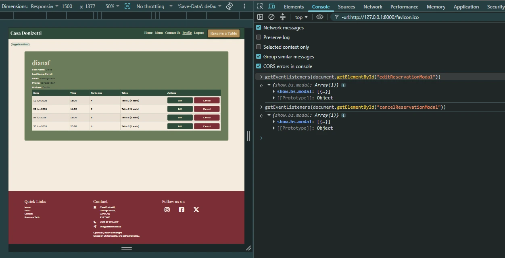 |
| No listener activity on non-profile page              | Open the homepage and inspect for profile modal elements or listeners in DevTools. | Profile modal elements are absent, or no modal listeners are attached. | Profile modal elements were absent and no modal listeners were attached. | PASS | 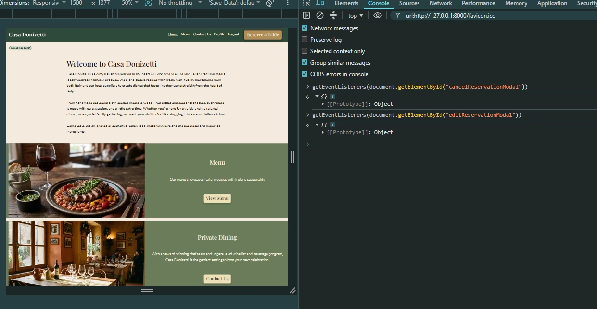          |
| Cancel modal populates                                | Click the cancel button with valid data attributes.                                | The modal displays the correct reservation date and cancel form action. | The modal displayed the correct reservation date and cancel form action. | PASS | 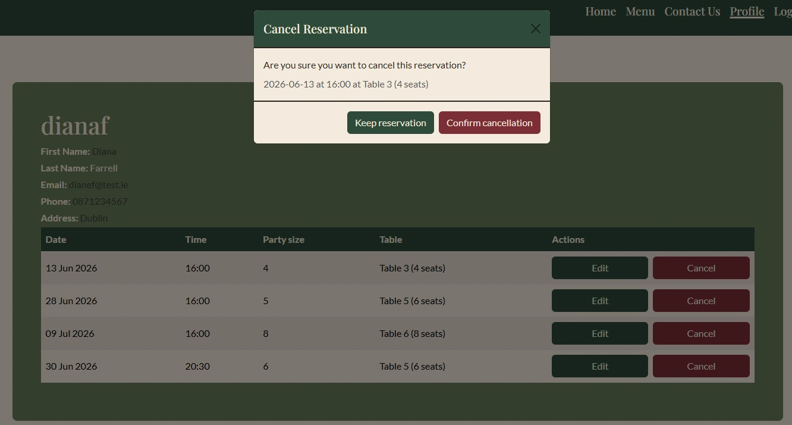                                 |
| Edit modal populates                                  | Click the edit button with valid data attributes.                                  | The modal pre-fills the date, time, party size, and form action correctly. | The modal pre-filled the date, time, party size, and form action correctly. | PASS | 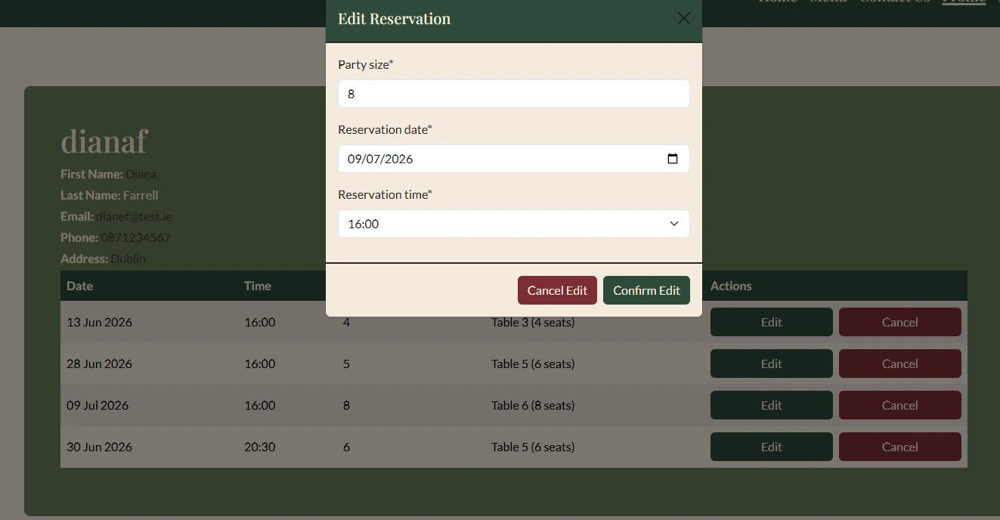                                     |
| Missing trigger data                                  | Remove a required data attribute from the modal trigger and open the modal.        | The script handles the missing value safely without console errors. | The script handled the missing value safely without console errors. | PASS | 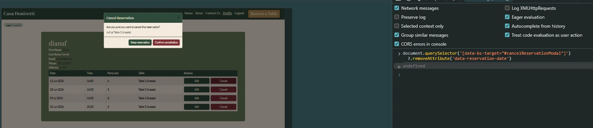                                     |
| Fields hidden on load                                 | Navigate to contact us page.                                                       | The party size and reservation date fields are hidden on load, and neither input is required. | The party size and reservation date fields were hidden on load, and neither input was required. | PASS | 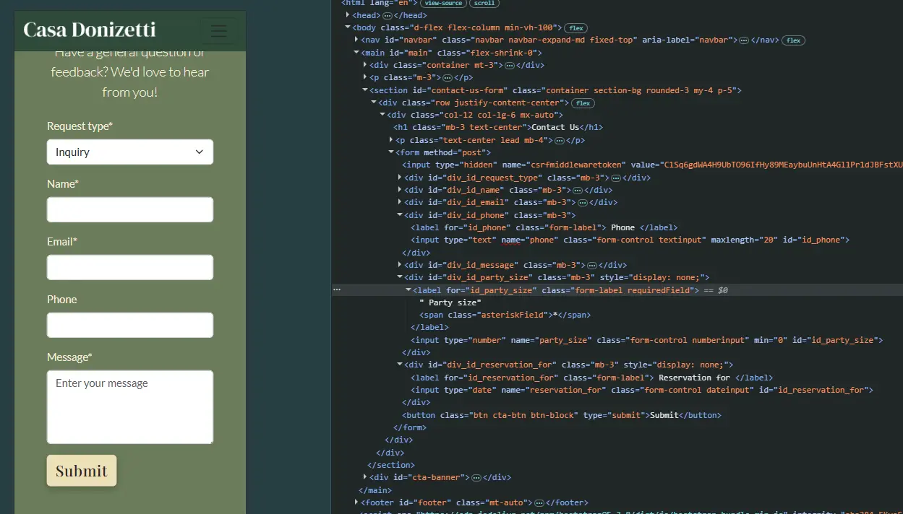                |
| Private dining fields shown when request type changes | Open the contact page and select `private_dining` from the request type dropdown.  | The party size and reservation date fields are displayed, and both inputs become required. | The party size and reservation date fields were displayed, and both inputs became required. | PASS | 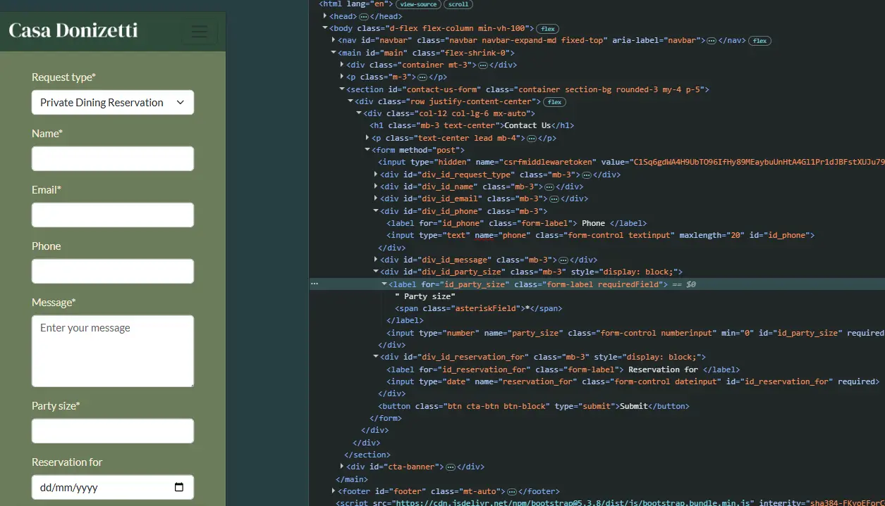                       |
---
## Automated Django Tests

Automated tests were created using Django’s built-in testing framework to verify core backend functionality, including models, forms, views, authentication, and reservation logic.

### Running tests
```bash
python manage.py test
```
All automated Django tests passed successfully.

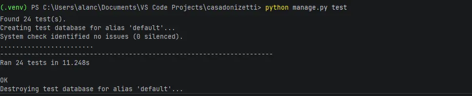

---

## Validation Testing

### HTML Validation

Rendered HTML files were validated using the W3C Markup Validation Service and djlint. Any issues identified were corrected during development.

### CSS Validation

The custom CSS file was tested using the W3C CSS Validation Service.

### JavaScript Validation

JavaScript was tested using JSHint. The script passed without major errors.

### Lighthouse Testing

Lighthouse was used to test performance, accessibility, best practices, and SEO across key pages.

# Code

## Code Sources and Credits

The following resources were used for guidance, implementation support, and debugging during development. Most of the implementation was guided by course material, official documentation, and selected tutorials, with additional adaptation and problem-solving carried out during development.

### Django and Python
- **Custom context processors:** Used to provide global footer data from model objects.  
  Reference: [Lab of Coding – Custom Context Processors](https://labofcoding.com/posts/how-to-write-custom-context-processors-in-django/)

- **ModelForm widgets and form customisation:** Used to customise form fields, widgets, and validation behaviour.  
  References:  
  [Django Widgets](https://docs.djangoproject.com/en/4.2/topics/forms/widgets/)  
  [Django ModelForms](https://docs.djangoproject.com/en/6.0/topics/forms/modelforms/)  
  [YouTube tutorial](https://www.youtube.com/watch?v=-oWIyFYyNQw&t)

- **`cleaned_data` attribute:** Used to access validated form data after form submission.  
  Reference: [Django Form Validation](https://docs.djangoproject.com/en/5.2/ref/forms/validation/)

- **Datetime conversion:** Used to convert reservation time values before combining them into a single datetime object.  
  References:  
  [Python datetime documentation](https://docs.python.org/3/library/datetime.html)  
  [GeeksforGeeks – `strptime`](https://www.geeksforgeeks.org/python-datetime-strptime/)

- **QuerySet filtering and exclusion:** Used when checking reserved and available tables.  
  References:  
  [W3Schools – Django QuerySet filter](https://www.w3schools.com/django/django_queryset_filter.php)  
  [Stack Overflow – filter/exclude against list](https://stackoverflow.com/questions/50904405/django-filter-exclude-against-list-of-objects)

- **Conditional Django forms:** Used to adjust reservation form behaviour depending on whether the user is logged in.  
  References:  
  [Django Form Fields](https://docs.djangoproject.com/en/6.0/ref/forms/fields/)  
  [Stack Overflow – remove fields from ModelForm](https://stackoverflow.com/questions/1466512/remove-fields-from-modelform)

- **`add_error()` usage:** Used to attach non-field validation errors to the reservation form when no suitable table was available.  
  Reference: [Django Form Validation](https://docs.djangoproject.com/en/5.2/ref/forms/validation/)

- **Validators:** Used to validate form and model inputs.  
  Reference: [Django Validators](https://docs.djangoproject.com/en/6.0/ref/validators/)

- **`refresh_from_db()` in tests:** Used in reservation edit tests to reload updated model values from the database.  
  Reference: [Django Model Instance Reference](https://docs.djangoproject.com/en/6.0/ref/models/instances/)

- **Allauth customisation:** Used to implement custom authentication flows and templates.  
  References:  
  [Django Allauth documentation](https://docs.allauth.org/en/dev/index.html)  
  [BugBytes – Django Allauth Deep Dive](https://www.youtube.com/playlist?list=PL-2EBeDYMIbQqZZoo5Dj8YAkPnZeJfcZS)

- **Editing default Allauth forms:** Used when customising form field classes and layout.  
  References:  
  [Stack Overflow – add class to Django form field](https://stackoverflow.com/questions/29716023/add-class-to-form-field-django-modelform)  
  [GitHub Gist reference](https://gist.github.com/ronaldgreeff/3b2da951245860f262408496c6ef36a3)

- **Custom model validation:** Used to validate the contact form.  
  Reference: [Django Central – Custom Model Validation in Django](https://djangocentral.com/custom-model-validation-in-django/)

## Bugs and Fixes

- **Cloudinary deployment issue on Heroku:** Deployment failed until `cloudinary://` was added before the API key in the Heroku config variable.

- **Datetime type error:** Encountered `TypeError: combine() argument 2 must be datetime.time, not str`. This was fixed by converting the submitted time string into a `datetime.time` object before using `datetime.combine()`.

- **Malformed email confirmation link:** When testing email confirmation with the terminal email backend, the generated confirmation URL appeared malformed. The issue was resolved by correcting the link format before use.

- **Edit reservation date field not populating correctly:** The date input required `YYYY-MM-DD` format to display correctly in the form, even though the user-facing format was `DD/MM/YYYY`.

- **Testing `reservation_view` with `login_required`:** Automated tests initially failed because the test client was not authenticated. This was fixed by logging in the test user with `self.client.login(...)`.

- **Unexpected redirect status in reservation form test:** A test originally expected a `200` response, but the valid form submission correctly returned a `302` redirect. The assertion was updated to reflect the actual expected behaviour.

- **Circular import when overriding Allauth forms:** A circular import occurred when custom Allauth forms were defined in the main forms module. This was fixed by moving the custom signup and login forms into separate files.  
  Reference: [Stack Overflow – partially initialised module import error](https://stackoverflow.com/questions/72717979/python-importerror-cannot-import-name-from-partially-initialized-module)

- **Login form styling issue:** Applying `form-control` to all login form inputs broke the “remember me” checkbox styling. This was fixed by excluding checkbox inputs from that class.

- **Empty reservation table layout issue:** When a user had no reservations, the empty-state message only displayed in one table cell. This was fixed by applying the correct `colspan` value to the `<td>`.

- **Naive datetime warning:** A runtime warning appeared because `Reservation.reservation_for` received a naive datetime. Fixed by adding timezone-aware datetime handling in the reservation views and tests. Source: https://stackoverflow.com/questions/18622007/runtimewarning-datetimefield-received-a-naive-datetime

- **Rendering error:** Fixed an issue where the restaurant view rendered a `div` inside a `span` due to Summernote rich text editor output.

---

# Tools and Resources

**Development Environment:**
- PyCharm for code editing and debugging
- GitHub for version control
- Heroku for deployment

**Languages & Frameworks:**
- HTML5, CSS, JavaScript ES8 for frontend development
- Bootstrap 5.3 for responsive design and components
- Python 3.12.4 for backend development
- Django 6.0.1 framework for web application architecture

**Libraries & UI Components:**
- Font Awesome for icons

**Validation & Testing Tools:**
- W3C Markup Validation Service and djlint Python package for HTML validation
- W3C CSS Validation Service for CSS validation
- JSHint for JavaScript linting and error checking
- Lighthouse for performance and accessibility testing

**Content & Design Tools:**
- Perplexity for discovery, text content generation, and drafting documentation. 
- Canva for wireframing and image editing
- Artlist.io for generative image creation
- TinyPNG for image compression
- Draw.io for entity relationship model

---

# Deployment

## Heroku Deployment

This project was deployed to Heroku.

### Deployment Steps

1. Create a new Heroku app.
2. Connect the Heroku app to the GitHub repository.
3. Add the required config vars in Heroku Settings.
4. Add a PostgreSQL database using the Heroku database add-on or external database provider.
5. Push the project to GitHub.
6. Deploy the selected branch from Heroku.
7. Run migrations.
8. Create a superuser.
9. Load fixture data if required.

### Required Config Vars

| Key | Purpose |
|-----|---------|
| `DATABASE_URL` | PostgreSQL database connection string |
| `SECRET_KEY` | Django secret key |
| `CLOUDINARY_URL` | Cloudinary media storage configuration |

### Local Deployment

To run this project locally:

1. Clone the repository.
2. Create and activate a virtual environment.
3. Install dependencies.
4. Create an `env.py` file with required environment variables.
5. Run migrations.
6. Start the development server.

```bash
pip install -r requirements.txt
python manage.py migrate
python manage.py runserver
```